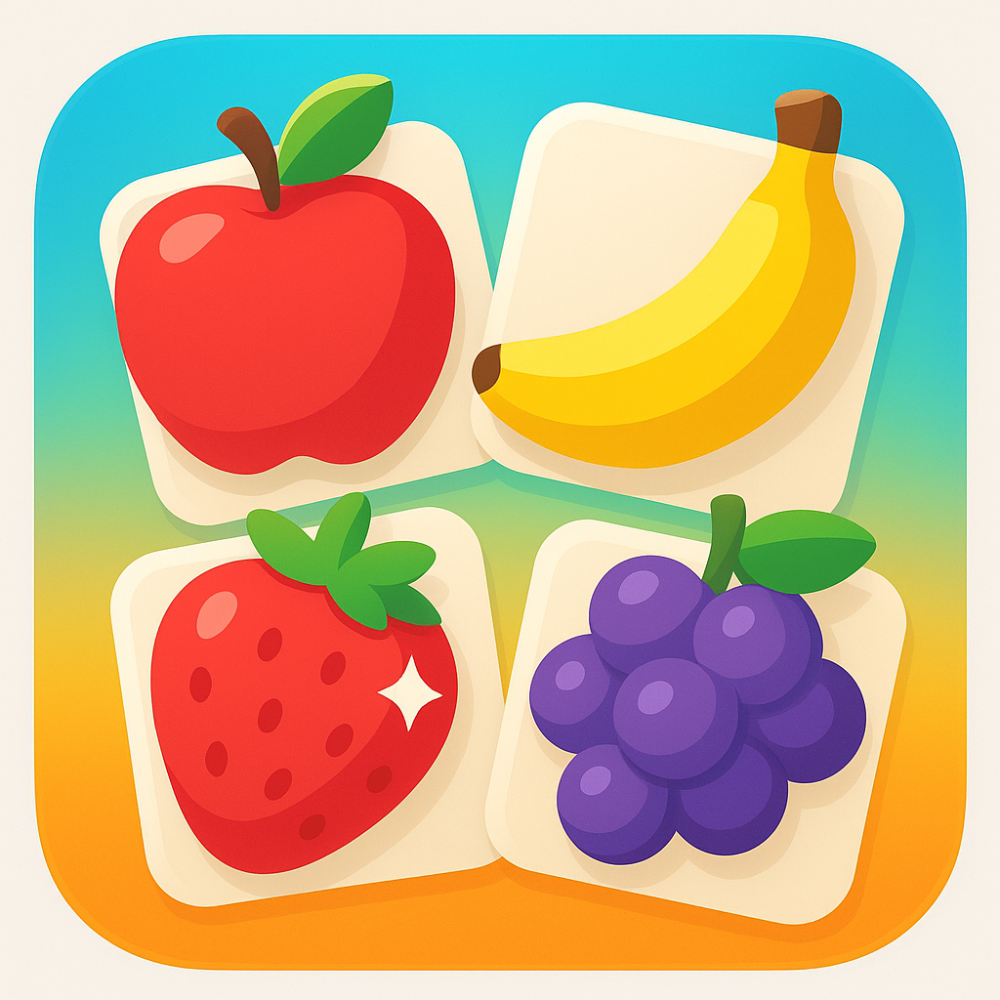

# Fruit Memory Game

This is an Android application implementing a fruit-themed memory matching game using WebView to load an HTML/JS/CSS-based game interface. The game allows users to match fruit emojis on cards, with features like difficulty levels, timer, move counter, best scores, and high contrast mode.

## Features
- **Memory Matching Game**: Flip cards to match pairs of fruits.
- **Difficulty Levels**: Easy (4 pairs), Medium (8 pairs), Hard (12 pairs).
- **Game Stats**: Tracks moves, time, and best scores (saved locally).
- **Audio Feedback**: Sounds for flips, matches, and win.
- **Progress Bar**: Visual progress indicator.
- **High Contrast Mode**: Accessibility feature for better visibility.
- **Offline Compatible**: No external dependencies; all assets local.

## Technologies
- **Android**: Kotlin with AppCompatActivity and WebView.
- **Frontend**: HTML5, CSS3 (custom styles), JavaScript (vanilla).
- **Build System**: Gradle (Kotlin DSL).

## Screenshots
 <!-- Placeholder; replace with actual screenshot if available -->

The game board shows a 4x4 grid of cards (adjusts for difficulty). Cards flip to reveal fruits like 🍎, 🍌, etc.

## Setup Instructions
1. **Clone the Repository**:
   ```
   git clone https://github.com/AboFaris73/FruitMemoryGame.git
   cd FruitMemoryGame
   ```

2. **Open in Android Studio**:
   - Launch Android Studio.
   - Select "Open an existing Android Studio project" and choose the project directory.

3. **Build the Project**:
   - Ensure you have the Android SDK installed (API level 24 or higher recommended).
   - Click "Build" > "Make Project" or use Gradle sync.

4. **Run the App**:
   - Connect an Android device or start an emulator.
   - Click "Run" > "Run 'app'" to install and launch the app.
   - The game loads in WebView from local assets.

## Known Issues/Fixes
- Cards were initially not visible due to external CSS CDN failing in WebView. Fixed by implementing custom offline CSS styles.

## Contributing
Feel free to fork the repo, make changes, and submit pull requests. Improvements to game logic, additional fruits, or Android features are welcome.

## License
This project is open source. See the LICENSE file for details (add if needed).